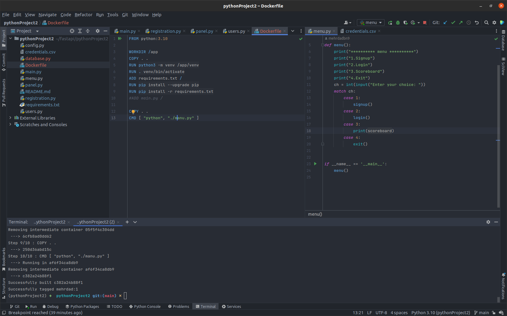

## shell Rock, Paper, Scissors game

this is a python shell game of popular Rock, Paper, Scissors.
- [x] it is using python 3.10 with updated feature somehow like switch case method
- [x] the passwords has been hashed base on OWASP TOP 10
- [x] it has registration system
- [x] tries to be modular and consider SOLID principle
- [x] dockerized 
- [ ] using argparse for menu